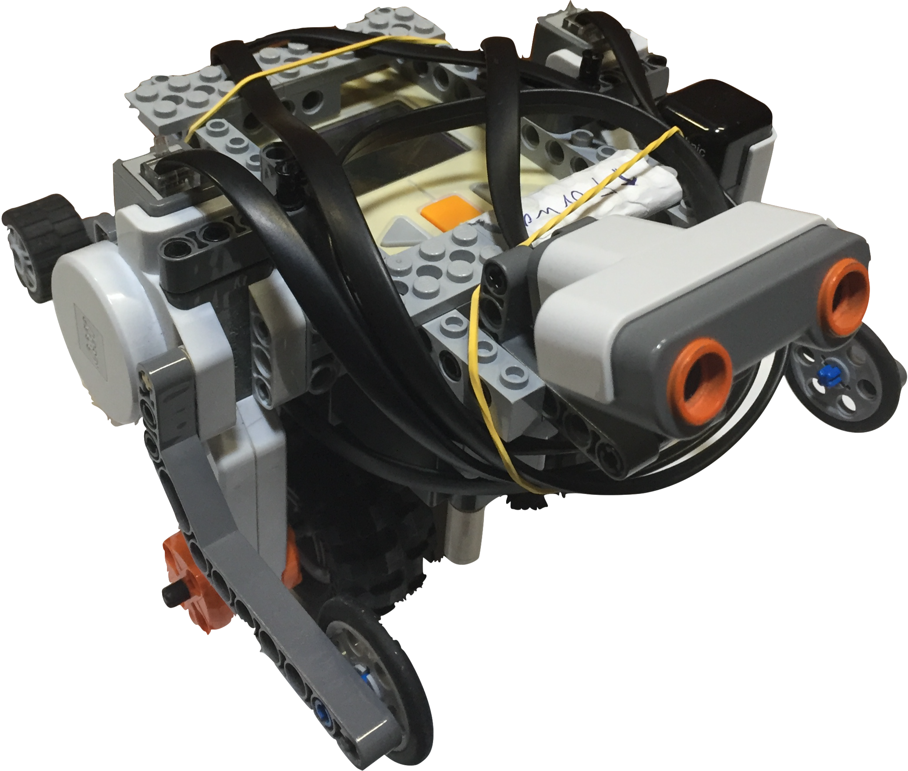
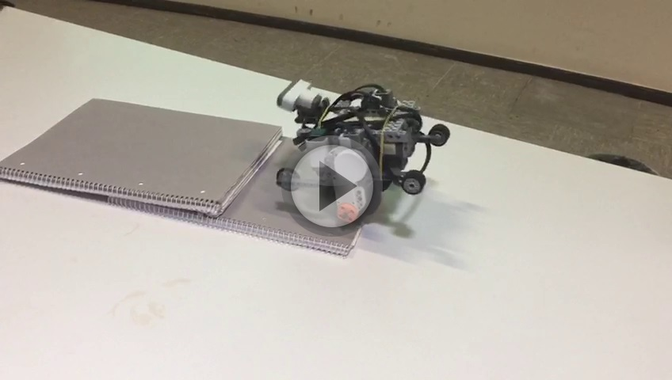

# NXT Praktikum

Im Rahmen des Praktikums Entwicklung NXT-gesteuerter LEGO-Fahrzeuge mit Java stand unser Team vor der Aufgabe,
aus dem Lego Mindstorm NXT 1.0 Set einen Segway zu bauen und diesen über das LeJOS Betriebssystem mit Java funktionsfähig zu machen.
Dabei sollte in diesem Projekt die Softwareentwicklung mit Scrum angewendet werden.
Das Praktikum bestand dabei aus einer Reihe von Abnahmen und Zwischenvorträgen, um den aktuellen Stand des Projekts zu überprüfen, sowie einem [Abschlussbericht](report/main.pdf).

## Demonstration

	
	Überwindung von Unebenheiten.

